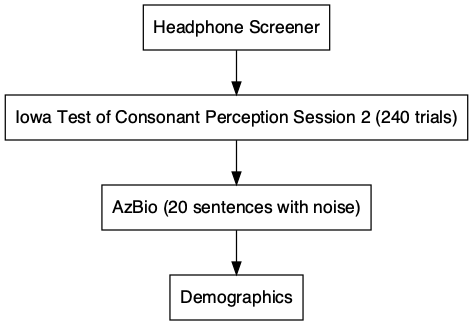

<style type="text/css">
.remark-slide-content {
    font-size: 22px;
    padding: 1em 4em 1em 4em;
}


```{r xaringan-themer, include=FALSE, warning=FALSE}
library(xaringanthemer)
library(xaringanExtra)
style_mono_accent(
  base_color = "#1c5253",
  header_font_google = google_font("Josefin Sans"),
  text_font_google   = google_font("Open Sans", "300", "300i"),
  code_font_google   = google_font("Fira Mono")
)
```
---

background-image:url("images/cocktail.jpeg")

```{r setup, include=FALSE}
options(htmltools.dir.version = FALSE)
```
---
# Closed vs. Open-Set Tasks
+ Open-set

<html>
  <head>
    <title>Audio</title>
  </head>
  <body>
    <script>
      function play() {
        var audio = document.getElementById("audio");
        audio.play();
      }
    </script>
    <input type="button" value="PLAY" onclick="play()">
    <audio id="audio" src="ball_noise.wav"></audio>
  </body>
</html>


--

```{r,fig.width=12, fig.align="center", fig.height=8,echo=FALSE}
knitr::include_graphics('images/open.jpeg')

```	

---

# Closed vs. Open-Set Tasks
+ Closed-set

  - Fall
  - Ball
  - Shawl
  - Wall

```{r,fig.width=12, fig.align="center", fig.height=10,echo=FALSE}


```	

---
# Issues 

- Sentence based (open-set) tasks are generally preferred as they are the most ecologically valid 
 
- However: 
  + Open-set tasks are difficult to use experimentally
     -  Engages a whole host of processes not related to speech perception
  
- We need a closed-set task that better approximates everyday listening situations

 + Lexical competition
 + Talker variability

---


# Iowa Test of Consonat Perception

+ 4-AFC closed-set (single word) SiN task 
  - 120 target words
  -Spoken by 4 speakers (2 women)
  - Foils were minimal pairs differing by first consonant

```{r,fig.width=8, fig.align="center", fig.height=4,echo=FALSE}


```	

---

background-image: url("images/empty_bottle_03.jpeg")

---

background-image: url("images/bob.jpeg")

---
# Procedure
+ Two sessions (1 week apart)
 - Used Gorilla and Prolific <br> <br>
--
```{r, echo=FALSE , warning=FALSE, message=FALSE}
library(datapasta)
library(kableExtra)

d=data.frame(
     stringsAsFactors = FALSE,
          check.names = FALSE,
               Factor = c("Age","Gender","Female",
                          "Male","Other","Race","Asian",
                          "Black or African American","White","Unknown"),
  `M/N(range and %)` = c("27 (23, 35)","", 
                          "48 (49%)","48 (49%)","1 (1.0%)","","9 (22%)",
                          "11 (27%)","21 (51%)","56")
)

d %>%
  kbl() %>%
  kable_classic_2(full_width = F)

```

---

# Procedure
+ Session 1 (N=199)
+ Session 2 (N=98) <br> <br>
--
.pull-right[

```{r, message=FALSE, warning=FALSE, echo=FALSE}
library(DiagrammeR)
library(DiagrammeRsvg)
library(magrittr)
library(rsvg)
grViz("digraph flowchart {
      # node definitions with substituted label text
      node [fontname = Helvetica, shape = rectangle]        
      tab1 [label = '@@1']
      tab2 [label = '@@2']
      tab3 [label = '@@3']

      # edge definitions with the node IDs
      tab1 -> tab2 -> tab3;
      }

      [1]: 'Headphone Screener'
      [2]: 'Iowa Test of Consonant Perception Session 1'
      [3]: 'Consonant-Nucleus-Consonant (CNC)Task'
      ")%>%


    export_svg %>% 
  charToRaw %>% 
  rsvg_png("graph1.png")


```

```{r,fig.width=12, fig.align="center", fig.height=4,echo=FALSE}
knitr::include_graphics('graph1.png')

```	
]
--
.pull-left[

```{r, message=FALSE, warning=FALSE, echo=FALSE}

grViz("digraph flowchart {
      # node definitions with substituted label text
      node [fontname = Helvetica, shape = rectangle]        
      tab1 [label = '@@1']
      tab2 [label = '@@2']
      tab3 [label = '@@3']
      tab4 [label = '@@4']

      # edge definitions with the node IDs
      tab1 -> tab2 -> tab3 -> tab4;
      }

      [1]: 'Headphone Screener'
      [2]: 'Iowa Test of Consonant Perception Session 2'
      [3]: 'AzBio'
      [4]: 'Demographics'
      ") %>% 
    export_svg %>% 
  charToRaw %>% 
  rsvg_png("graph2.png")
```

```{r,fig.width=12, fig.align="center", fig.height=8,echo=FALSE}


```	
]
---
# Reliability
 +  <font size="5"> Test-Retest </font>
  - ICC = .8
```{r, echo=FALSE, warning=FALSE, message=FALSE}
library(osfr)
library(ggstatsplot)
library(tidyverse)
library(DiagrammeR)
# use opst to read in files from osfpage
d= osf_retrieve_file("https://osf.io/dqm67/") %>%
    osf_download(conflicts = "skip")

icc_itcp<-read_csv("itcp_cnc_azbio_summary.csv")

```


```{r fig.align='center',fig.width=12, fig.align="center", fig.height=6,echo=FALSE,  warning=FALSE, message=FALSE}

session12=ggstatsplot::ggscatterstats(
  data = icc_itcp,
  x = session1,
  y = session2,
  bf.message = FALSE, 
  xlab = "Session 1 of ITCP",
  ylab = "Session 2 of ITCP",
  type= "r", 
  xfill = "#0072B2", # color fill for x-axis marginal distribution
  yfill = "#009E73", # color fill for y-axis marginal distribution
  xalpha = 0.6, # transparency for x-axis marginal distribution
  yalpha = 0.6, # transparency for y-axis marginal distribution
point.size = 4,
results.subtitle=FALSE, 
xsize=1, 
ysize=1, 
ggstatsplot.layer = FALSE, 
ggplot.component = list(theme(text = element_text(size = 20, family="Arial")), ggplot.component=list(
        scale_y_continuous(limits = c(0, 1)),
         scale_x_continuous(limits = c(0, 1)))))

#d=ggsave("Azbio_new1.png", width=12, height=12, dpi=500, type = "cairo")
session12 

```
---
# Validity
+ CNC
  Lists 1 and 4 

```{r fig.align='center',fig.width=12, fig.align="center", fig.height=6,echo=FALSE,  warning=FALSE, message=FALSE}

cnc=ggstatsplot::ggscatterstats(
  data = icc_itcp,
  x = session1,
  y = meancnc,
  bf.message = FALSE, 
  xlab = "Session 1 of ITCP",
  ylab = "CNC",
  type= "r", 
  xfill = "#0072B2", # color fill for x-axis marginal distribution
  yfill = "#009E73", # color fill for y-axis marginal distribution
  xalpha = 0.6, # transparency for x-axis marginal distribution
  yalpha = 0.6, # transparency for y-axis marginal distribution
point.size = 4,
results.subtitle=TRUE, 
xsize=1, 
ysize=1, 
ggstatsplot.layer = FALSE, 
ggplot.component = list(theme(text = element_text(size = 20, family="Arial")), ggplot.component=list(
        scale_y_continuous(limits = c(0, 1)),
         scale_x_continuous(limits = c(0, 1)))))

#d=ggsave("Azbio_new1.png", width=12, height=12, dpi=500, type = "cairo")
cnc

```
---
# Validity
+ AzBio
  - 1 list of 20 sentences

```{r fig.align='center',fig.width=12, fig.align="center", fig.height=6,echo=FALSE,  warning=FALSE, message=FALSE}

cnc=ggstatsplot::ggscatterstats(
  data = icc_itcp,
  x = session1,
  y = mean_az,
  bf.message = FALSE, 
  xlab = "Session 1 of ITCP",
  ylab = "AzBio",
  type= "r", 
  xfill = "#0072B2", # color fill for x-axis marginal distribution
  yfill = "#009E73", # color fill for y-axis marginal distribution
  xalpha = 0.6, # transparency for x-axis marginal distribution
  yalpha = 0.6, # transparency for y-axis marginal distribution
point.size = 4,
results.subtitle=TRUE, 
xsize=1, 
ysize=1, 
ggstatsplot.layer = FALSE, 
ggplot.component = list(theme(text = element_text(size = 20, family="Arial")), ggplot.component=list(
        scale_y_continuous(limits = c(0, 1)),
         scale_x_continuous(limits = c(0, 1)))))

#d=ggsave("Azbio_new1.png", width=12, height=12, dpi=500, type = "cairo")
cnc

```


---
# Future

+ Validate in lab 
 - We have data from 50 participants and data look comparable. 

+ Can we use this type of online testing for patients (e.g., Cochlear implant patients)

---

# What Future Me Learned From Past Me

+ Give bonuses for completing second session - set up separate studies on recruitment platform. 
+ Be explicit in your study subscription. 
+ Email subjects multiple times to remind them of an upcoming session. 
+ Try to make experiment length reasonable

---


